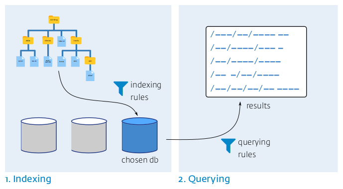

Lolcate
=======

**A comically fast way of indexing and querying your filesystem. Replaces locate / mlocate / updatedb. Written in Rust.**


Lolcate is a fast, lightweight, versatile alternative to [locate / mlocate / updatedb](https://pagure.io/mlocate).

It features:

- **indexing rules** allowing you to easily specify which path names to index and which ones to prune ;
- powerful, UTF8-compliant **querying rules** ;
- the ability to create **multiple databases** for multiple purposes.

Lolcate comes as a single binary executable.

Lolcate doesn't try to be compatible with mlocate / updatedb.

# Synopsis



Lolcate operates in two phases:

1. It indexes parts of your filesystem by obeying some *indexing rules* you specified to populate one of its databases with the list of matching path names.

   Only the path names of the files are indexed, Lolcate isn't concerned with their contents.

   Different databases can be created for different purposes.
   
2. Whenever needed, you can run lolcate to perform queries against its databases and it will return the path names matching the *querying rules* you specified.

The same `lolcate` binary executable performs both indexing and querying.

# Guide

**Creating a database**

Before using Lolcate, a database needs to be created. Let's create one:
```sh
$ lolcate --create
Created database 'default'.
Please edit:
- the configuration file: /home/ngirard/.local/share/lolcate/default/config.toml
- the ignores file:       /home/ngirard/.local/share/lolcate/default/ignores
```
   
Since we didn't specify the name of the database, Lolcate chose the name `default`. We could have specified the name of the database using `lolcate --create --db <db_name>`.

**Indexing rules: specifying what to index**

Next, we need to specify what to index by editing two files (this might change in a future version), the `config.toml` file and the `ignores` file.

The `config.toml` file doesn't come empty but filled with boilerplate contents you'll need to customize. It should look like this:

```toml
description = ""

# Directories to index.
dirs = [
  # "/first/dir",
  # "/second/dir"
]

# Set to true if you want to index directories
include_dirs = false

# Set to true if you want skip symbolic links
ignore_symlinks = false

# Set to true if you want to index hidden files and directories
ignore_hidden = false
```

Let's modify it and add two directories for indexing:

```
dirs = [
  "~/Images",
  "~/Documents"
]
```

As you noticed, the directories must be quoted and comma-separated. Also, tildes in directories are expanded, but not environment variables.

The `ignores` file contains patterns Lolcate will use to ignore matching path names while indexing the filesystem. The syntax of the `ignores` file is the same as for the [.gitignore files](https://git-scm.com/docs/gitignore). You can leave it empty if you want to index everything according to the `config.toml` file.

Let's modify it and add these two patterns:

```
.git
*~
```

**Indexing the filesystem**

Now, we are ready to tell Lolcate to index the filesystem according to the rules we just specified:

```sh
$ lolcate --update
Updating default...
```

Again, Lolcate updates the `default` database by default. We can choose to update another one by typing `lolcate --update --db <other_db>`. We can also ask Lolcate to update all the databases we have by typing `lolcate --update --all`.

**Querying a database**

Now that our database is populated, we can run queries against it.

-   The simplest form is just `lolcate [--db <dbname>]`:

    ```sh
    $ lolcate
    /home/ngirard/Images/DCIM_101CANON/_MG_0006.jpg
    /home/ngirard/Images/DCIM_101CANON/_MG_0007.jpg
    /home/ngirard/Images/DCIM_101CANON/_MG_0004.jpg
    (...)
    ```

    When no pattern is given, the query returns everything from the database.
    
    `lolcate --all` will return everything from all of your databases.

-   We might also want to specify a pattern by running `lolcate [--db <dbname>] <pattern>`:

    ```sh
    $ lolcate 2018
    /home/ngirard/Images/2018/01/9/IMG_1057.JPG
    /home/ngirard/Images/2018/01/9/IMG_1059.JPG
    /home/ngirard/Images/2018/01/9/IMG_1060.JPG
    (...)
    ```

-   Patterns are interpreted as regular expressions.

    For instance, let's look for any path names containing either 2018 or 2019:

    ```sh
    $ lolcate 201[89]
    /home/ngirard/Images/2018/01/9/IMG_1057.JPG
    /home/ngirard/Images/2018/01/9/IMG_1059.JPG
    (...)
    /home/ngirard/Images/2019/01/9/IMG_1055.JPG
    /home/ngirard/Images/2019/01/9/IMG_1058.JPG
    (...)
    ```

    The complete syntax for the regex engine used by Lolcate is available [here](https://docs.rs/regex/latest/regex/#syntax).
    
-   Multiple patterns can be specified using `lolcate <pattern1> <pattern2> ...`.

    For instance, let's look for all readme files from the Images directory:
    ```sh
    $ lolcate Images readme
    /home/ngirard/Images/DCIM_101CANON/readme.txt
    /home/ngirard/Images/2019/01/1/Readme
    /home/ngirard/Images/2018/01/1/readme
    ```

-   The search for patterns is "smart-case" by default. It means that patterns are searched case-insensitively when all in lowercase, and sensitively otherwise.

    For instance, running the latest query with "Readme" instead of "readme" gives:
    ```sh
    $ lolcate Images Readme
    /home/ngirard/Images/2019/01/1/Readme
    ```

    We can perform a case-insensitive search using the `-i | --case-insensitive` option: 
    ```sh
    $ lolcate -i Images README
    /home/ngirard/Images/DCIM_101CANON/readme.txt
    /home/ngirard/Images/2019/01/1/Readme
    /home/ngirard/Images/2018/01/1/readme
    /home/ngirard/Documents/READMEs/2018-05-15-Cropping_images.txt
    /home/ngirard/Documents/READMEs/2018-05-15-Cropping_images_fig1.jpg
    /home/ngirard/Documents/READMEs/2018-05-15-Cropping_images_fig2.png
    ```

-   A pattern can be matched against the base name of path names only, using the `-b | --basename` option:
    ```sh
    $ lolcate -b images
    /home/ngirard/Documents/READMEs/2018-05-15-Cropping_images.txt
    /home/ngirard/Documents/READMEs/2018-05-15-Cropping_images_fig1.jpg
    /home/ngirard/Documents/READMEs/2018-05-15-Cropping_images_fig2.png
    ```

-   Path types can be defined and queried for.

    Path types can be defined by adding them to Lolcate's global configuration file. We can locate this file by invoking the `--info` option:
    ```sh
    $ lolcate --info
    Config file:
    /home/ngirard/.local/share/lolcate/config.toml
    (...)
    ```
    
    No path types are predefined, but the global configuration file contains boilerplate we can use to define ours.
    
    For instance, if we edit the global configuration file as follows
    ```
    [types]
    img = ".*\\.(jp.?g|png|gif|JP.?G)$"
    video = ".*\\.(flv|mp4|mp.?g|avi|wmv|mkv|3gp|m4v|asf|webm)$"
    doc = ".*\\.(pdf|chm|epub|djvu?|mobi|azw3|odf|ods|md|tex|txt)$"
    audio = ".*\\.(mp3|m4a|flac|ogg)$"
    ```

    the path types can be used in queries:
    ```sh
    $ lolcate --type img cropping
    /home/ngirard/Documents/READMEs/2018-05-15-Cropping_images_fig1.jpg
    /home/ngirard/Documents/READMEs/2018-05-15-Cropping_images_fig2.png
    ```
    
-   Path name patterns, base name patterns and type patterns can be mixed altogether:

    ```sh
    $ lolcate --basename [eé]conomie --type doc
    /home/ngirard/Documents/Notes/2018-11-12-Economie_politique.tex
    /home/ngirard/Documents/Notes/2019-01-03-Économie_politique.md
    ```

    ```sh
    $ lolcate --basename [eé]conomie --type doc 2018
    /home/ngirard/Documents/Notes/2018-11-12-Economie_politique.tex
    ```
    
# Installation

Download the latest `lolcate` precompiled binary from [Github](https://github.com/ngirard/lolcate-rs/releases) into a directory belonging to your `PATH`.

Precompiled binaries are currently only available for Linux.

## Installation from sources

1. If needed, install the [current stable release of Rust and Cargo](https://doc.rust-lang.org/cargo/getting-started/installation.html) using

   ```sh
   $ curl https://sh.rustup.rs -sSf | sh
   ```
   
2. If needed, add `~/.cargo/bin` to your `PATH` using e.g.:

   ```sh
   $ export PATH=$HOME/.cargo/bin:$PATH
   ```
   
3. Run
     $ cargo install lolcate
   to compile the sources from the latest release, or
     $ cargo install --git https://github.com/ngirard/lolcate-rs
   to compile the latest version of the sources from the GitHub repository.

# Contributing

While all contributions are welcome, the ideal contributions for me would be finely-grained pull requests, as they would allow me to improve my Rust literacy while reviewing them. Thanks in advance !

There are a number of areas you might want to consider contributing to:

-   The most needed feature is the colored printout of pattern matches.

-   Lolcate is not yet useable as a library.

-   I'm not satisfied with the ignores rules being kept in a separate configuration file.

-   Testing.

    I'd be very interested in advice on existing code I could reuse / take advantage of in order to provide Lolcate with a complete testing bench.

-   Backend strategy.

    Lolcate currently stores its data as a lz4-compressed list of path names, and recreates it each time `lolcate --update` is run. It's as simple as you can get. Alghough it works well enough to my taste, I'd be glad to consider alternatives.
   
# Acknowledgements

- I wish to thank the Rust community for producing such a great developing environment. It's the best environment I've been working with so far !

- A big thanks to [Andrew Gallant](https://blog.burntsushi.net/about/) for his tremendous work and the invaluable crates he wrote, which Lolcate relies upon (regex, ignore, walkdir).

- The approach of simply recreating the database instead of udating it for performance purposes, which Lolcate currently uses, has been discussed multiple times on the Internet. I couldn't find my related notes, so I'd be glad to share any references you could provide.

- The name "lolcate" has already been used for a prototype shell script [published as a Github Gist](https://gist.github.com/drhodes/1673187) in 2012. It was too good a name to not reusing it !

- Credits for the laughing cat image: [Rikki's Refuge](https://www.flickr.com/photos/rikkis_refuge/)
